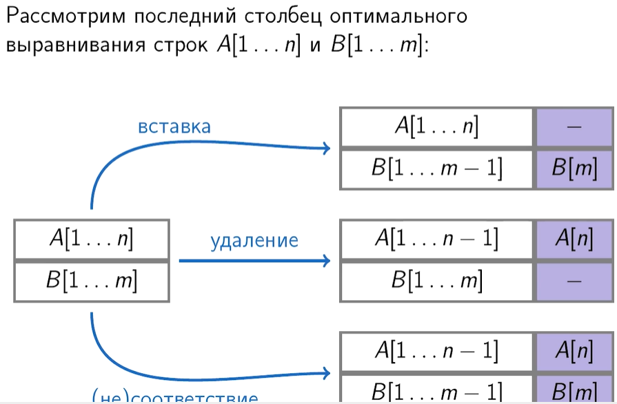
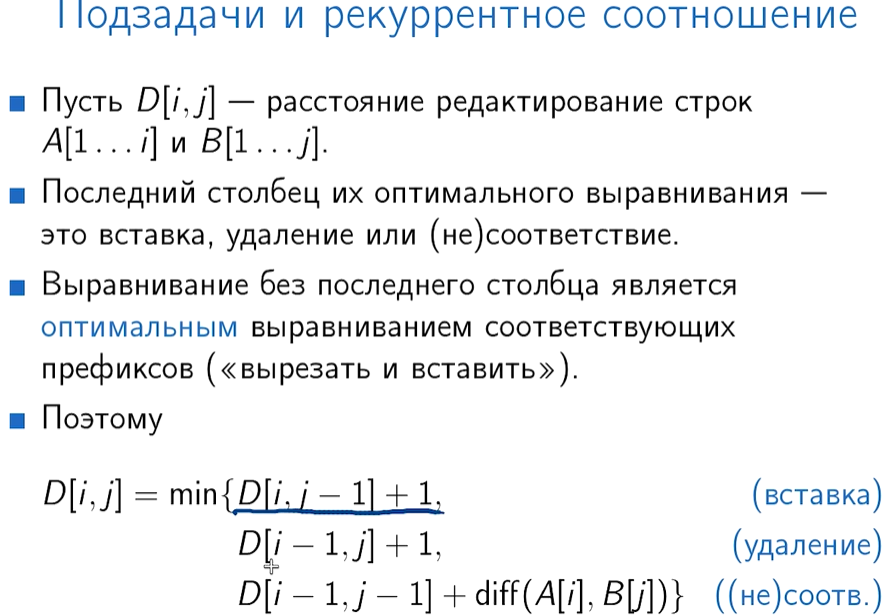
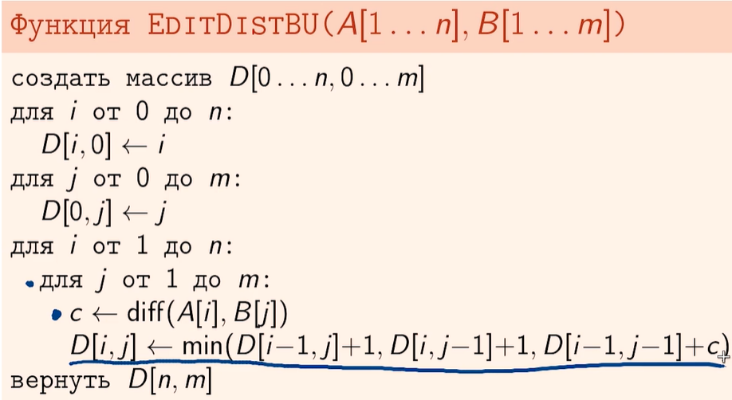

## Минимальное расстояние редактирование или алгоритм Левенштейна

Ключевое замечание. Во время изменения мы меняем не одну из строк, а сразу две строки, т.е.
мы можем выполнить операцию как над одной так и над второй строкой:

- удалить символ в первой строке
- добавить символ во второй строке
- заменить символы в одной или во второй строке

Рекурентное соотношение:

Формула решения снизу вверх. т.е. от простого до сложного

