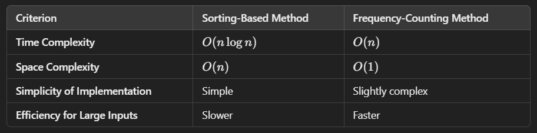

# Frequency-Counting Method

## Comparasion

#### Recommendation:

* Use the sorting-based method if you prioritize simplicity and the strings are relatively short.
* Use the frequency-counting method if performance is critical and the input strings are long. It is both faster and
  more memory-efficient.