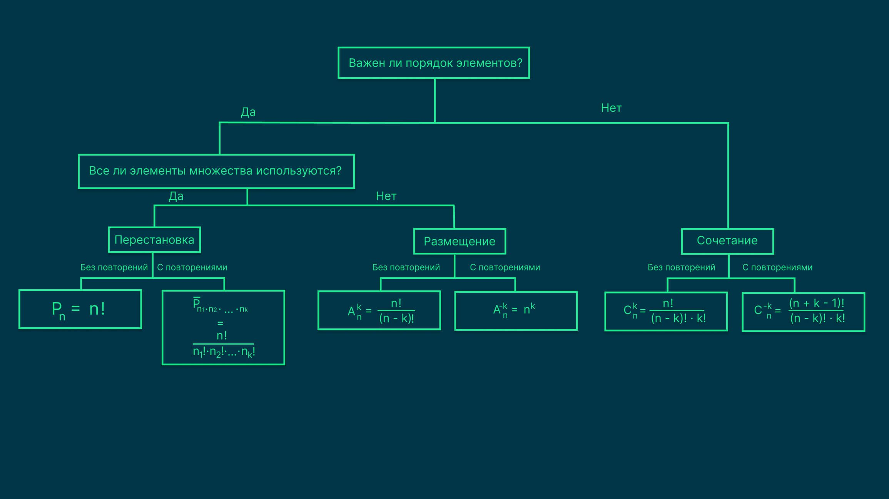
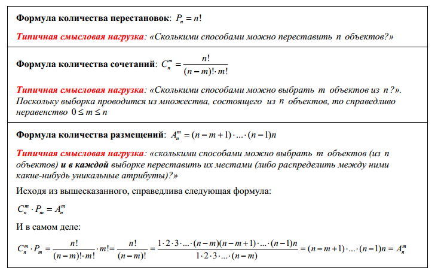

Комбинаторика — это раздел математики, в котором изучается выбор и размещение элементов, взятых из некоторого множества.

В комбинаторике три базовые конфигурации:

- Перестановка — это способ последовательно расположить элементы во множестве.
- Сочетание — это набор элементов, который можно выбрать из множества без учёта порядка.
- Размещение — это упорядоченный набор элементов, который можно выбрать из множества.
В зависимости от того, повторяются или нет составляющие множества, для подсчёта всех комбинаций используются разные формулы.

В комбинаторике рассматриваются два существенно различных вида комбинаций.
Комбинации, в которых имеет значение порядок элементов, называются размещениями.
В размещениях у каждого элемента — своя определённая роль. Например, пара учеников — староста класса и его помощник, пара цифр — десятки и единицы.
Размещения — это упорядоченные наборы.
Комбинации, при составлении которых важно знать только то, какие элементы выбраны, но их порядок не имеет значения, называются сочетаниями.

Общее число сочетаний из m элементов в группах по n обозначается Cmn. 
## Это число вычисляется по формуле: Cmn=m! /n!(m-n)!

## Формула размещений:A n m = n ! ( n − m ) !

Перестановки: Количество перестановок обозначается как P n , где n — количество элементов множества.
## Перестановки вычисляются по формуле P n = n ! 

Если дано множество из двух элементов {a; b}, из этого множества можно составить две упорядоченные выборки: a; b и b; a.

# Упорядоченнные выборки элементов с повторением n из множества m: A {nm} = n^m

